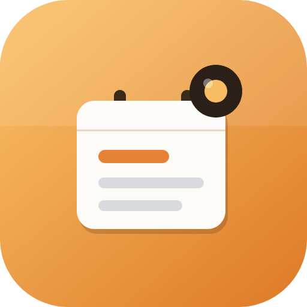
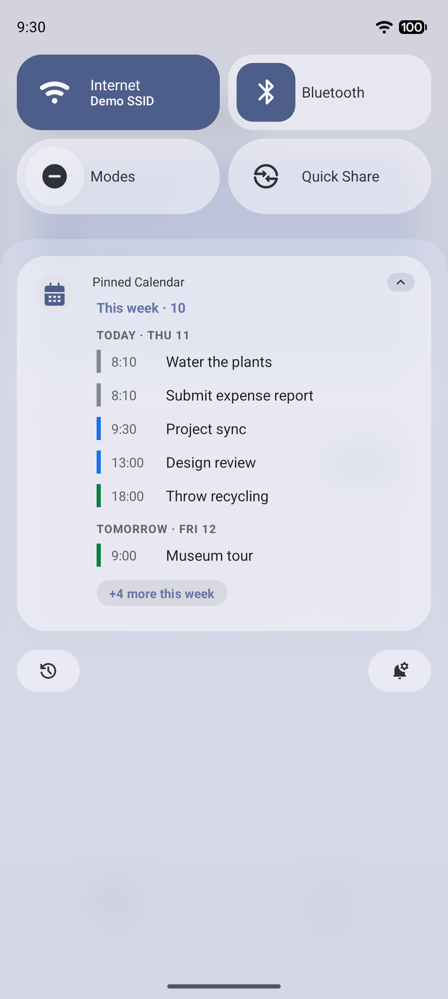
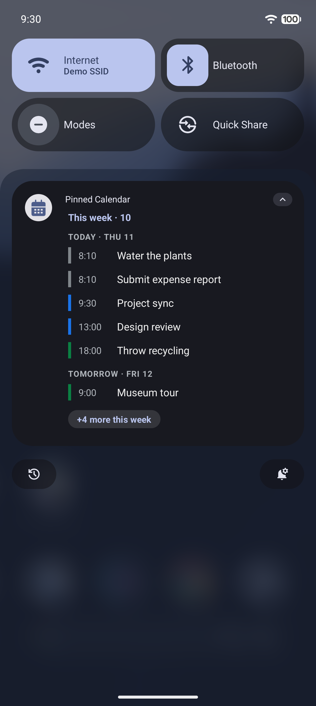
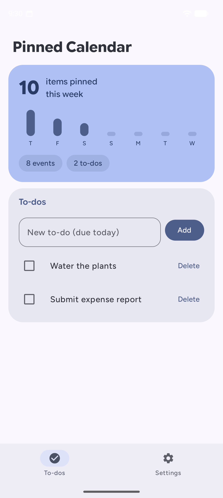
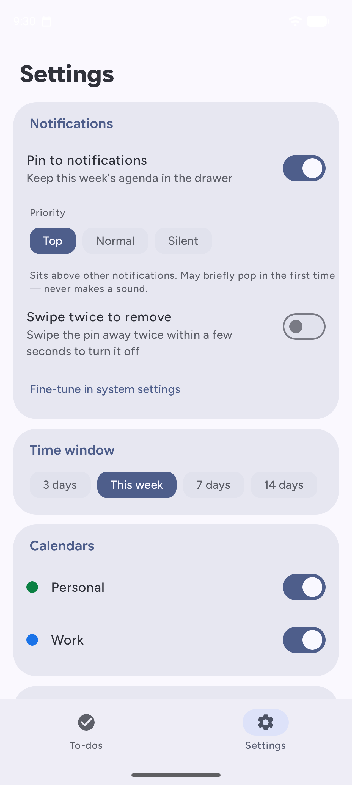

<a name="readme-top"></a>

<div align="center">



# Pinned Calendar

Your week's Google Calendar events and to-dos in a single persistent Android notification.<br/>
No sign-in, no cloud, no internet permission. Your schedule never leaves the phone.

**[Website][website-link]** · **[Google Play][play-link]** · [Releases][releases-link] · [Privacy][privacy-link] · [Report an issue][issues-link]

<!-- SHIELDS GROUP -->

[![][release-shield]][releases-link]
[![][play-shield]][play-link]
[![][platform-shield]][platform-link]
[![][minsdk-shield]][minsdk-link]<br/>
[![][kotlin-shield]][kotlin-link]
[![][compose-shield]][compose-link]
[![][ci-shield]][ci-link]
[![][downloads-shield]][releases-link]
[![][license-shield]][license-link]

<a href="https://play.google.com/store/apps/details?id=dev.ahnafnafee.pinnedcalendar"></a>

<table>
  <tr>
    <td align="center"><b>Pinned agenda (light)</b></td>
    <td align="center"><b>Pinned agenda (dark)</b></td>
    <td align="center"><b>To-dos tab</b></td>
    <td align="center"><b>Settings tab</b></td>
  </tr>
  <tr>
    <td></td>
    <td></td>
    <td></td>
    <td></td>
  </tr>
</table>

</div>

> \[!NOTE]
> Pinned Calendar reads the calendars already synced on your device through Android's Calendar Provider. There is no Google sign-in, no OAuth, and no `INTERNET` permission: everything stays on the phone.

<details>
<summary><kbd>Table of contents</kbd></summary>

#### TOC

- [✨ Features](#-features)
- [📦 Installation](#-installation)
- [🧭 Configuration](#-configuration)
- [🏗️ How it works](#%EF%B8%8F-how-it-works)
- [🔒 Privacy and permissions](#-privacy-and-permissions)
- [🧰 Tech stack](#-tech-stack)
- [⌨️ Building from source](#%EF%B8%8F-building-from-source)
- [🗺️ Roadmap](#%EF%B8%8F-roadmap)
- [🤝 Contributing](#-contributing)
- [📝 License](#-license)
- [🙏 Acknowledgements](#-acknowledgements)

</details>

## ✨ Features

### `1` Always-on agenda pin

An ongoing notification keeps this week's events and to-dos at the top of the shade, and it is self-healing: swipe it away by accident and it re-posts itself. Set its priority to Top, Normal, or Silent. Top keeps it above your everyday notifications without ever popping up or making a sound, and an optional swipe-twice gesture dismisses it for good without opening settings. The pin restores itself after reboots and app updates.

### `2` Rich to-dos

Add quick tasks in the app and they merge into the same agenda, carrying forward day to day until completed or deleted. Tap a to-do to edit it: rename, schedule with quick chips (today, tomorrow, next week) or any date and time, set a priority flag whose color rides into the pin, and attach notes. Recurrence includes daily, weekly, monthly, and yearly presets plus custom intervals, selectable weekdays, and endings by date or occurrence count. Completing a recurring to-do advances it to the first upcoming occurrence, skipping missed dates while preserving month-end, leap-year, and local-time intent. The list groups into Overdue, Today, Upcoming, and Completed. An opt-in setting sends an alerting, swipeable reminder notification whenever a scheduled occurrence comes due, leaving the pin untouched. Android can show it as a heads-up alert when system notification settings allow.

### `3` The pin, your way

A live preview in settings renders the actual notification (collapsed or expanded) as you tune it: density presets (Compact, Cozy, Comfortable, or Custom sliders), how many rows show before expanding, day grouping with Today, Tomorrow, and weekday sections, and heading toggles. Tap an event row to open it in Google Calendar; tap anywhere else on the pin to jump into the app.

### `4` Material You theming

Wallpaper-based dynamic color, seed colors, palette styles, AMOLED black, selectable fonts, and light, dark, or system themes, plus a theme- and accent-adaptive launcher icon.

### `5` Private by design

No accounts, no ads, no trackers, no cloud, and no `INTERNET` permission. The app reads your device calendars with per-calendar colors and sends nothing anywhere.

### `6` Light on battery

No foreground service. Background refresh runs on WorkManager with a ContentObserver for instant updates when a calendar changes, plus an optional battery-optimization exemption for aggressive OEMs.

<div align="right">

[![][back-to-top]](#readme-top)

</div>

## 📦 Installation

The easiest way is Google Play:

<a href="https://play.google.com/store/apps/details?id=dev.ahnafnafee.pinnedcalendar"></a>

Prefer sideloading? Grab the signed APK from the [latest release][releases-link] and install it (you may need to allow installs from unknown sources).

> \[!TIP]
> On first launch, grant Calendar and Notification access, then turn on "Pin to notifications". On aggressive OEMs, also enable "Ignore battery optimizations" under Reliability so the pin keeps updating.

<div align="right">

[![][back-to-top]](#readme-top)

</div>

## 🧭 Configuration

The app is split into two tabs.

**To-dos**, the week at a glance:

- Week overview card: how many items are pinned, day by day.
- Add, complete, and delete local to-dos that merge into the pinned agenda.
- Tap a to-do to edit it: rename, schedule (today · tomorrow · next week · any date and time), choose preset or custom recurrence rules, set a priority flag that colors its bar in the pin, and attach notes.

**Settings**, everything else, Material You styled:

- Notifications: pin on/off, priority (Top · Normal · Silent), optional swipe-twice-to-remove, and opt-in to-do reminders as alerting, swipeable notifications that are heads-up eligible when system settings allow.
- Notification layout: a live preview of the pin, density presets (Compact · Cozy · Comfortable · Custom), rows shown before expanding, and the heading toggles.
- Time window: 3 days · this week · 7 days · 14 days.
- Calendars: toggle each synced calendar on or off.
- Display: group by day, hide completed to-dos, 24-hour time, and a max-items cap.
- Appearance: theme, Material You, AMOLED, accent seed, palette style, and font.
- Reliability: battery-optimization exemption.

<div align="right">

[![][back-to-top]](#readme-top)

</div>

## 🏗️ How it works

```
Device Calendar Provider ─┐
                          ├─► AgendaRepository ─► NotificationContentBuilder ─► ongoing notification
Local to-dos (DataStore) ─┘            ▲                                              │ deleteIntent
                                       │                                              ▼
              WorkManager (15-min refresh) + ContentObserver        SelfHealReceiver re-posts on swipe
```

A pure-Kotlin core (windowing, day-bucketing, content building) is unit-tested and decoupled from Android, and the platform layer (RemoteViews, WorkManager, receivers) consumes it. There is no foreground service: the notification persists on its own, and a delete-intent receiver makes it self-healing.

<div align="right">

[![][back-to-top]](#readme-top)

</div>

## 🔒 Privacy and permissions

Pinned Calendar is offline-first. It has no `INTERNET` permission and sends nothing off the device.

| Permission | Why it's needed |
|---|---|
| `READ_CALENDAR` | Read the events already synced on your device. |
| `POST_NOTIFICATIONS` | Show the pinned agenda (Android 13+). |
| `RECEIVE_BOOT_COMPLETED` | Re-pin the agenda after a reboot. |
| `SCHEDULE_EXACT_ALARM` | Fire opt-in to-do reminders on time; falls back to inexact when denied. |
| `REQUEST_IGNORE_BATTERY_OPTIMIZATIONS` | Optional: keep background refresh reliable on aggressive devices. |

No accounts, ads, trackers, or cloud. Full policy: [pinnedcalendar.ahnafnafee.dev/privacy][privacy-link].

<div align="right">

[![][back-to-top]](#readme-top)

</div>

## 🧰 Tech stack

| Area | Technology |
|---|---|
| Language | Kotlin 2.2 |
| UI | Jetpack Compose · Material 3 |
| Dynamic color | [MaterialKolor](https://github.com/jordond/MaterialKolor) · Material You |
| Background work | WorkManager · `ContentObserver` · `AlarmManager` (reminders) |
| Storage | DataStore (Preferences) |
| Calendar | `CalendarContract` (Calendar Provider) |
| Notification | `NotificationCompat` · custom `RemoteViews` |
| Build | AGP 9.2 · Gradle 9.5 · `compileSdk 36` · `minSdk 26` |

<div align="right">

[![][back-to-top]](#readme-top)

</div>

## ⌨️ Building from source

Prerequisites: Android Studio (latest), JDK 17+, and Android SDK Platform 36.

```bash
git clone https://github.com/ahnafnafee/pinned-calendar.git
cd pinned-calendar
./gradlew :app:assembleDebug          # build a debug APK
./gradlew :app:installDebug           # install on a connected device/emulator
./gradlew :app:testDebugUnitTest      # run the unit tests
```

Or open the project in Android Studio and run it.

<div align="right">

[![][back-to-top]](#readme-top)

</div>

## 🗺️ Roadmap

- [ ] Full color-picker for custom seed colors
- [ ] Home-screen widget companion
- [x] Per-to-do due-date picker
- [x] To-do priorities, notes, and due-time reminders
- [ ] Google Tasks integration (opt-in)
- [x] Recurring-task support
- [ ] Wear OS tile

Have an idea? [Open an issue][issues-link].

<div align="right">

[![][back-to-top]](#readme-top)

</div>

## 🤝 Contributing

Contributions are welcome. Fork the repo, create a feature branch, run `./gradlew :app:testDebugUnitTest`, and open a pull request. For larger changes, open an issue first to discuss the approach.

<div align="right">

[![][back-to-top]](#readme-top)

</div>

## 📝 License

Released under the MIT License. See [`LICENSE`](LICENSE).

## 🙏 Acknowledgements

- [MaterialKolor](https://github.com/jordond/MaterialKolor) for seed-based Material You theming.
- The bundled fonts (Figtree, Outfit, Inter, Google Sans Flex) and the Material 3 design system.
- Google Play and the Google Play logo are trademarks of Google LLC.

<div align="right">

[![][back-to-top]](#readme-top)

</div>

<!-- LINK GROUP -->

[back-to-top]: https://img.shields.io/badge/-BACK_TO_TOP-151515?style=flat-square
[ci-link]: https://github.com/ahnafnafee/pinned-calendar/actions/workflows/ci.yml
[ci-shield]: https://img.shields.io/github/actions/workflow/status/ahnafnafee/pinned-calendar/ci.yml?branch=main&label=CI&style=flat-square
[compose-link]: https://developer.android.com/jetpack/compose
[compose-shield]: https://img.shields.io/badge/Jetpack%20Compose-Material%203-4285F4?logo=jetpackcompose&logoColor=white&style=flat-square
[downloads-shield]: https://img.shields.io/github/downloads/ahnafnafee/pinned-calendar/total?label=Downloads&style=flat-square&color=E07F2C
[issues-link]: https://github.com/ahnafnafee/pinned-calendar/issues
[kotlin-link]: https://kotlinlang.org
[kotlin-shield]: https://img.shields.io/badge/Kotlin-2.2-7F52FF?logo=kotlin&logoColor=white&style=flat-square
[license-link]: LICENSE
[license-shield]: https://img.shields.io/badge/License-MIT-yellow.svg?style=flat-square
[minsdk-link]: https://developer.android.com/about/versions/oreo
[minsdk-shield]: https://img.shields.io/badge/Min%20SDK-26%20(Android%208.0)-3DDC84?style=flat-square
[platform-link]: https://www.android.com
[platform-shield]: https://img.shields.io/badge/Platform-Android-3DDC84?logo=android&logoColor=white&style=flat-square
[play-link]: https://play.google.com/store/apps/details?id=dev.ahnafnafee.pinnedcalendar
[play-shield]: https://img.shields.io/badge/Google%20Play-Pinned%20Calendar-01875F?logo=googleplay&logoColor=white&style=flat-square
[privacy-link]: https://pinnedcalendar.ahnafnafee.dev/privacy/
[release-shield]: https://img.shields.io/github/v/release/ahnafnafee/pinned-calendar?sort=semver&style=flat-square&color=E07F2C
[releases-link]: https://github.com/ahnafnafee/pinned-calendar/releases/latest
[website-link]: https://pinnedcalendar.ahnafnafee.dev
